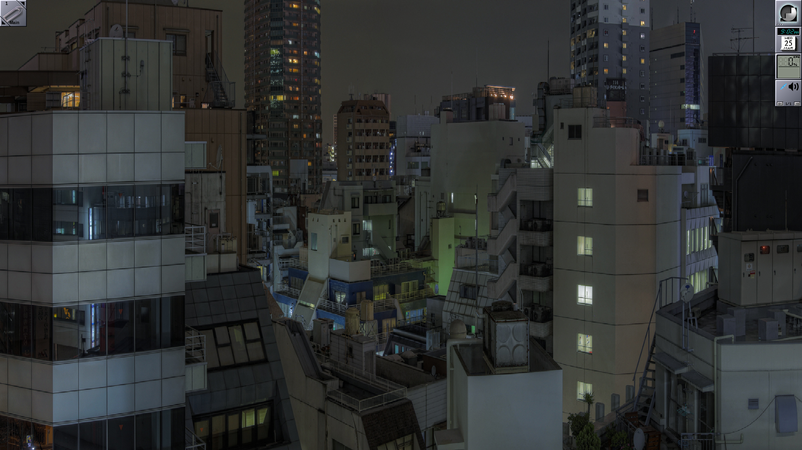
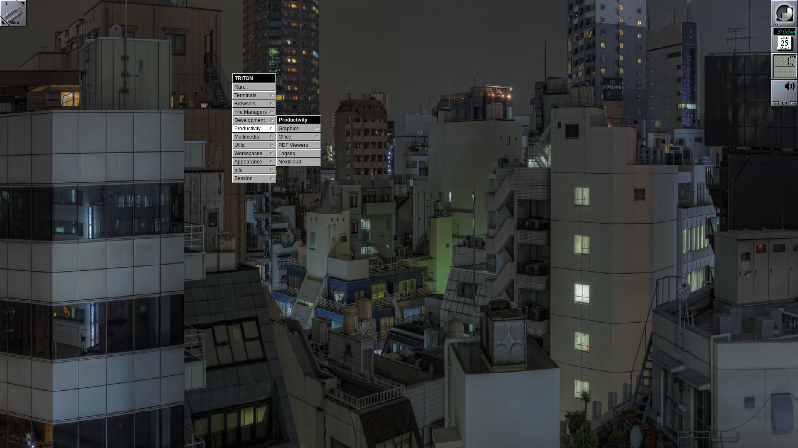
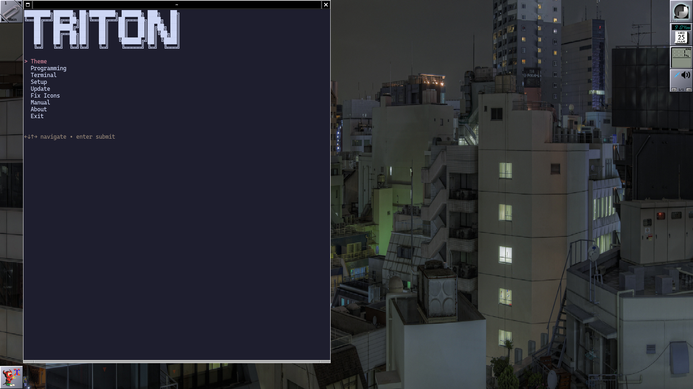
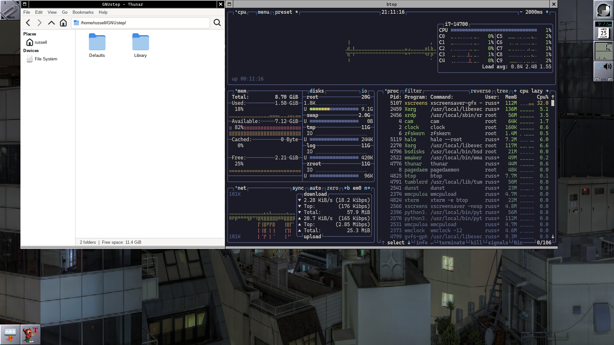
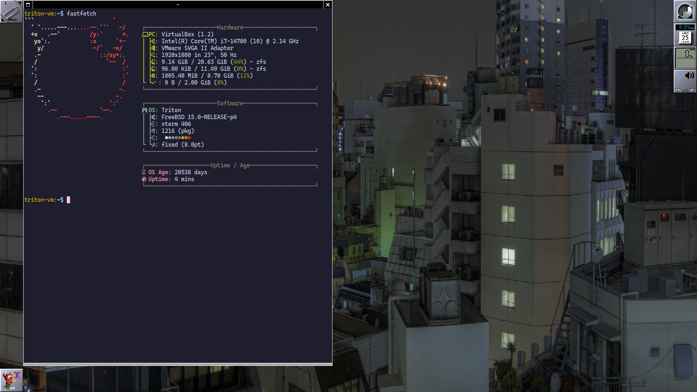
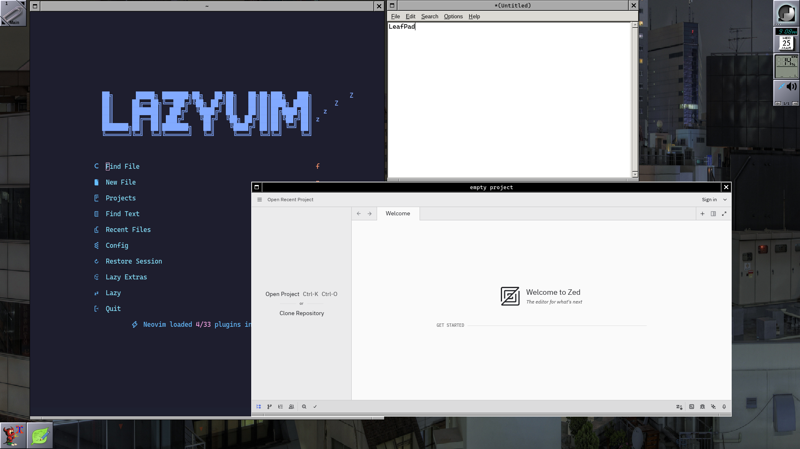

# Screenshots

Offered for your elucidation and amusment.

Fresh install first boot showing the default Tokyo Night theme.

Default WM menu.

Default Triton menu.

Thunar and btop

Fastfetch details.

Lazyvim, LeafPad, Zed.
